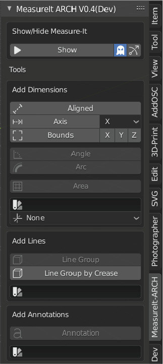
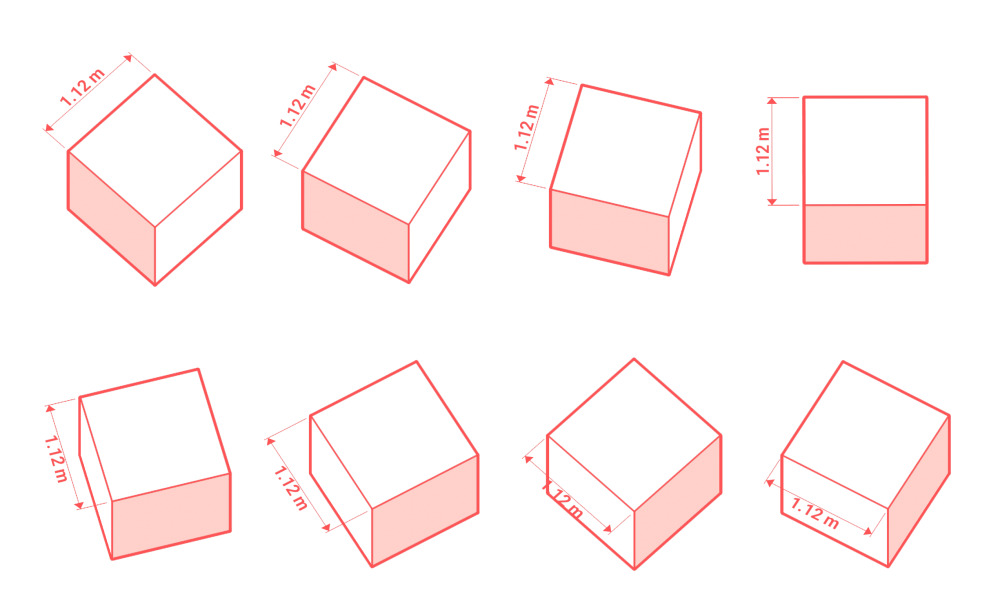
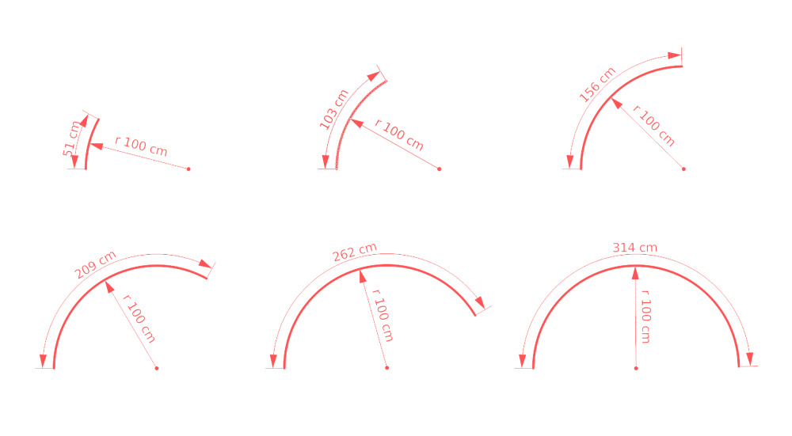
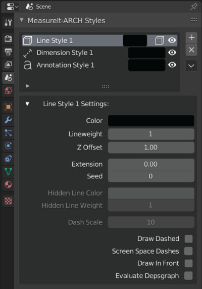
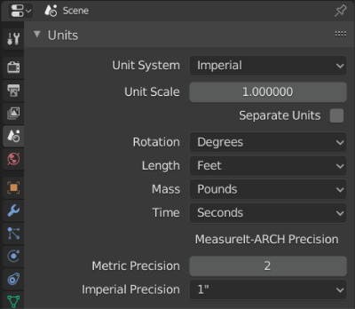
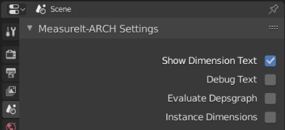

# MeasureIt_ARCH Dimension, Annotation and Linework tools for Blender 2.8

MeasureIt_ARCH is a fork of Antonio Vazquez's MeasureIt Addon.

## Click the image below to watch the latest update video

## Installation

 * [Install Blender 2.8 or higher](https://www.blender.org/download/)
 * [Download the latest git master zipfile](https://github.com/kevancress/MeasureIt_ARCH/archive/master.zip)
 * Open the __Add-on Preferences (Edit -> Preferences -> Add-ons)__.
   * If you have installed a previous version of the add-on, first find it by typing 'arch' then click 'remove' to uninstall.
 * Click __Install__ and select the downloaded file __MeasureIt_ARCH-master.zip__.
 * When the resulting list is updated to show the installed but disabled module, click the checkbox to enable the module.

## Features & User Interface

### Main Tool Panel

The main tool panel is where you can add MeasureIt_ARCH Items to your 3D scene. This panel is located on the right of the __3D Viewport__. Panel visibility can be toggled by pressing the "n" key.

#### Show / Hide MeasureIt_ARCH Toggle

 * Shows and hides all items created by MeasureIt_ARCH.

#### Selected Object Only Toggle (Ghost Icon)

 * When disabled, MeasureIt_ARCH will only show items belonging to currently selected objects.

#### Show Gizmos (Arrow Icon)

 * When enabled MeasureIt_ARCH will show gizmos for the selected object.

#### Add Dimensions

##### Aligned

 * Adds an Aligned Dimension between 2 Objects or Vertices.
   * Object Mode: Select two objects and then press the Aligned Button.
   * Edit Mode: Select two or more Vertices and press the Aligned Button.

##### Axis

 * Adds a Dimension that measures along a single Axis between 2 Objects or Vertices.
   * Object Mode: Select two objects and then press the Aligned Button.
   * Edit Mode: Select two or more Vertices and press the Aligned Button.

 * __Axis Selection__: Lets you pick the axis to be measured on creation.

##### Bounds (Object Mode Only)

 * Adds a set of Dimensions that measure the Bounding Box of the selected object
 * __Axis Selection__: Lets you pick the axes to be displayed on creation.

##### Angle (Edit Mode Only)

 * Adds an Angle Dimension for 3 selected vertices.
   * The 2nd vertex selected defines the corner of the angle.

##### Arc (Edit Mode Only)

 * Adds an Arc Dimension circumscribing the 3 selected vertices.

##### Area (Edit Mode Only)

 * Adds an Area Dimension to the selected faces.
   * The Area Dimension text will be placed at the center of the bounding box of the active face.

##### Dimension Style (Color Swatch Icon)

 * Lets you select a style to be assigned to new dimension on creation.

##### View Plane (Axis Icon)

 * Lets you select the preferred view plain for new dimensions (used to automatically place dimensions on creation).
   * __XY Plane (Plan View)__: Dimensions placed to be viewed from the top or bottom.
   * __YZ Plane (Section/ Elevation View)__: Dimensions placed to be viewed from the left or right.
   * __XZ Plane (Section/ Elevation View)__: Dimensions placed to be viewed from the front or back.
   * __None__: Dimensions placement will be based on the angles of the adjacent surfaces.

##### Add Lines

 * __Line Group (Edit Mode Only)__
   * Creates a Line Group from selected edges. Select the desired edges in edit mode and press the Line button.
 * __Line Group by Crease (Object Mode Only)__
   * Creates a Line Group from any edges sharper than the specified crease angle.

 * __Line Style (Color Swatch Icon)__: Style to be assigned to a new Line Group on creation.
   * Only visible after creating a Style in the Scene Settings.

##### Add Annotations

 * __Annotation__: Adds an Annotation to the selected Object or Vertex.  
 * __Annotation Style (Color Swatch Icon)__: Style to be assigned to new Annotation on creation.
   * Only visible after creating a Style in the Scene Settings.

### Scene Settings

MeasureIt_ARCH Styles & Settings can be found in the Scene Tab of the Properties Editor.

#### MeasureIt_ARCH Styles

Styles have a nearly identical user interface to their corresponding items. Style-able properties can be found in the item's settings.

Note that some settings, like an Annotations Offset, or a Dimensions Distance, are still set per item, even when using a style.

#### MeasureIt_ARCH Unit Settings

MeasureIt_ARCH Unit Settings can be found in Blender's Scene Settings under the Units panel. MeasureIt_ARCH makes use of Blender's Scene Unit System.

##### Metric Precision

 * Defines the number of decimal places included in your dimensions when using the Metric Unit System.

##### Imperial Precision

 * Fractional Precision to be used when using the Imperial Unit System.

#### MeasureIt_ARCH Settings

##### Show Dimension Text

 * Show or hide the text on Dimension and Annotation elements.

##### Debug Text

 * Writes Dimension Text to an image for Debug purposes.

##### Evaluate Depsgraph

 * Evaluate Blender's Dependency Graph before drawing MeasureIt_ARCH elements.
   * __WARNING__: By default, MeasureIt_ARCH does not evaluate the Dependency Graph as some generative modifiers can give unpredictable results. Enabling this setting will make MeasureIt_ARCH attempt to evaluate these modifiers during its calculations.

##### Instance Dimensions

 * Will Enable Dimension Instancing.
   * __WARNING__: Text on instanced Dimensions will not account for changes in the instances local scale or rotation.

#### Object Settings

 * Dimension, Annotation, and Line Group settings can be found in Object Tab of the Properties Editor.
   * These panels will only appear if the active object has a dimension, annotation or line group associated with it.
   * To add dimensions, annotations or line groups use the main tool panel.

#### Dimensions

 * __Color__: Sets Dimension Color.
 * __Link Style (Link or Broken Link Icon)__: Toggles if this Dimension uses a Style.
 * __Visibility (Eye Icon)__: Toggles the Dimension's visibility.
 * __Delete (x Icon)__: Deletes the Dimension.

#### Dimension Menu (Chevron Icon)
 * __Add to Area (Edit Mode Only)__: Adds selected Faces to the active Area Dimension.
 * __Remove from Area (Edit Mode Only)__: Removes selected Faces from the active Area Dimension.
 * __Cursor to Arc Origin__: Snaps the 3D cursor to the center of the active Arc Dimension.

#### Dimension Settings

 * __Font__: Lets you select a custom font for the Dimension.
 * __View Plane__: The preferred view plane for the Dimension.
   * __XY Plane (Plan View)__: Dimension will be placed to be viewed from the top or bottom.
   * __YZ Plane (Section/ Elevation View)__: Dimension will be placed to be viewed from the left or right.
   * __XZ Plane (Section/ Elevation View)__: Dimension will be placed to be viewed from the front or back.
   * __None__: Dimension's placement will be based on the angles of the adjacent surfaces.
 * __Measurement Axis (Axis & Bounds Dimensions Only)__: Select the Axis to Measure.
 * __Visible In View__: Limit the Dimension's visibility to a specific Camera in your scene.
   * If no Camera is selected the Dimension will be visible in all Cameras.
   * If a Camera is selected the Dimension will only be visible when that Camera is the Active Camera.
 * __Line Weight__: The Dimension's Line Weight.
 * __Distance__: The Distance of the Dimension Text from the Objects or Vertices it's attached to.
 * __Radius (Arc and Angle Dimensions Only)__: The Distance of the Dimension Text from the center of the Arc or Angle.
 * __Offset__: The offset distance from the ends of the Dimension line to the Vertex or Object it's attached to.
 * __Rotation__: Rotates the Dimension around the axis of its measurement.
 * __Font Size__: The Dimension font size.
 * __Resolution__: The Dimension font resolution.
 * __Alignment__: The Dimension text alignment relative to the dimension line (Left, Center, Right).
 * __Arrow Start & End__: Set the style of the dimension terminations. 
 * __Arrow Size__: The size of the Dimension's terminations.
 * __Arrow Angle__: The angle the of Dimension's triangle and arrow terminations.
 * __Draw In Front__: Makes this element Ignore Visibility tests.
 * __Evaluate Depsgraph__: Evaluate Blender's Dependency Graph before drawing this MeasureIt_ARCH element.

#### Line Groups

 * __Color__: Sets Line Group Color.
 * __Draw Hidden Lines (Cube with Dashed Lines Icon)__: This Line Group will draw hidden lines as dashed lines.
 * __Link Style (Link or Broken Link Icon)__: Toggles if this Line Group uses a Style.
 * __Visibility (Eye Icon)__: Toggles visibility of the Line Group.
 * __Delete (x Icon)__: Deletes the Line Group.
 * __Line Group Menu (Chevron Icon)__
   * __Add to Line Group (Edit Mode Only)__: Adds selected Edges to this Line Group.
   * __Remove from Line Group (Edit Mode Only)__: Removes selected Edges from this Line Group.

#### Line Group Settings

 * __Line Weight__: Set the Line Group's line weight.
 * __Line Weight Group__: Use a vertex group's values to modify the line weight.
 * __Influence__: Adjust the influence of the Line Weight Group.
 * __Z Offset__: Tweaks the Line Group's Distance from the screen in Clip Space. Higher values move the Lines closer to the screen.
   * This is useful for adjusting Line Groups that don't appear to be drawing correctly (Jagged Edges, etc.).
   * Making this value negative allows for the drawing of silhouettes. Higher values will move lines further backwards 
 * __Extension__: Adds a slight over-extension to each line segment in this Line Group. 
 * __Hidden Line Color (Only Available if Draw Hidden Lines is Enabled)__: Sets the color of hidden lines.
 * __Hidden Line Weight (Only Available if Draw Hidden Lines is Enabled)__: Sets the line weight of hidden lines.
 * __Dash Scale (Only Available if Draw Hidden Lines or Draw Dashed is Enabled)__: Changes the dash size of dashed lines. Larger values make smaller dashes.
 * __Dash Spacing (Only Available if Draw Hidden Lines or Draw Dashed is Enabled)__: Changes the dash spacing for dashed lines. 0.5 gives even spacing.
 * __Draw Dashed__: Draws all lines in this Line Group as dashed lines, regardless of visibility.
 * __Screen Space Dashes__: Calculates Dash Spacing in Screen Space. Useful to achieve more even dashes in still renders when some lines are nearly parallel to the view. Can cause dashes to appear to 'slide' along edges when used in animations.
 * __Draw In Front__: Makes this element Ignore Visibility tests.
 * __Evaluate Depsgraph__: Evaluate Blender's Dependency Graph before drawing this MeasureIt_ARCH element.

#### Annotations

 * __Color__: Sets Annotation Color.
 * __Link Style (Link or Broken Link Icon)__: Toggles if this Annotation uses a Style.
 * __Visibility (Eye Icon)__: Toggles the Annotations visibility.
 * __Delete (x Icon)__: Deletes the Annotation.
 * __Annotation Menu (Chevron Icon)__
   * __Add Text Field__: Adds a text field to the selected Annotation.
   * __Remove Text Field__: Removes the last text field from the selected Annotation.

#### Annotation Settings

 * __Text Field__: Sets the text for the annotation.
   * Annotations can have multiple text fields, each new text field will display as a new line in the Annotation Text.
 * __Font__: Lets you select a custom font for the Annotation from your system.
 * __Text Source__: MeasureIt_ARCH can pull annotation text from an objects Custom Properties metadata. This field defines the source custom property.
   * If two text fields are available, MeasureIt_ARCH will use the first to display the custom properties name, and the second to display the value.
   * If only one text field is available, only the value will be displayed.
 * __Size__: The Annotation font size.
 * __Resolution__: The Annotation font resolution.
 * __Justification__: Text Justification relative to the end of the Annotation leader line (Left, Center, Right).
 * __Position__: Text Position relative to the end of the Annotation leader line (Top, Middle, Bottom).
 * __Endcap__
   * __Dot__: Adds a Circle to the end of the Annotation Leader.
   * __Triangle__: Adds an Arrow to the end of the Annotation Leader.
 * __Endcap Size__: Sets the size of the Dimension Leader Endcap.
 * __Line Weight__: Line Weight of the Annotation leader.
 * __Offset__: The XYZ offset from the object or vertex that the annotation is attached to.
 * __Rotation__: The XYZ rotation of the annotation text.
 * __Draw In Front__: Makes this element Ignore Visibility tests.

#### Rendering

MeasureIt_ARCH Render Settings can be found in the Render Panel of the Properties Editor. Currently this renders all MeasureIt_ARCH items to an image file which can be layered over Blender's render in the compositor.

#### MeasureIt_ARCH Image

 * Renders a Still Image.
   * __WARNING__: If 'Save Render to Output' is not enabled the rendered image will only be stored in an image data-block within Blender.

#### MeasureIt_ARCH Animation

 * Renders the full frame range of the current scene.
   * Animation Renders can be Cancelled with the Esc key, or by Right Clicking in the 3D View.
   * A 3D Viewport window must be open for MeasureIt_ARCH to render animations.
   * Animation frames will be saved to the Output path defined in the Render Panel.

#### Save Render to Output

 * Saves Still Image renders to the Output path defined in the Render Panel after rendering.

