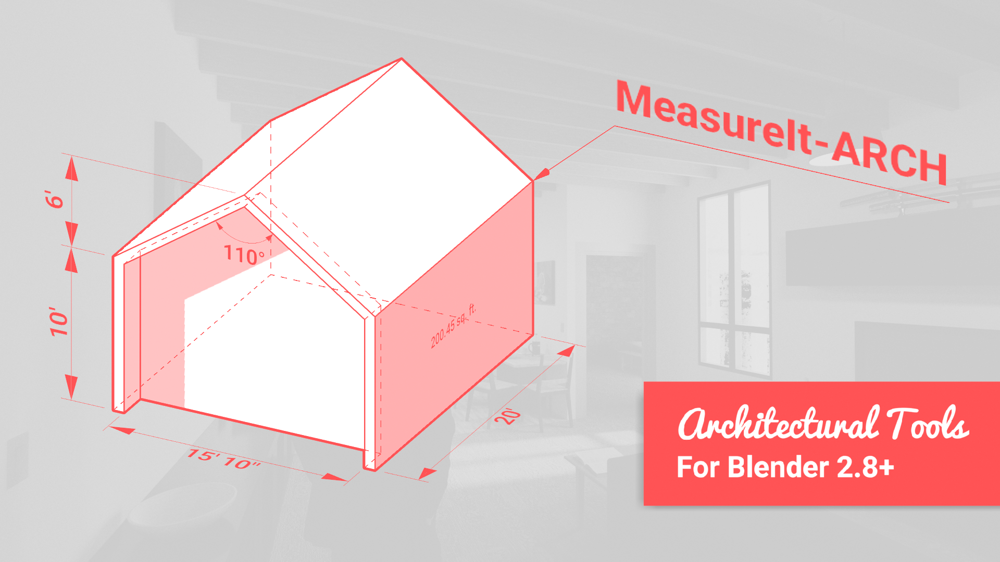

## What is MeasureIt_ARCH?

MeasureIt_ARCH is an addon for Blender, that adds tools to create design documentation and technical drawings that can be previewed within Blender's 3D viewport, and exported as images, vector graphics or .dxf files.

## Key Links

- [**Documentation:**](https://kevancress.github.io/MeasureIt_ARCH/)
- [**Install Instructions**](https://kevancress.github.io/MeasureIt_ARCH/tutorials/install/)
- [**Introduction:**](https://kevancress.github.io/MeasureIt_ARCH/intro/features/) An overview of MeasureIt_ARCH, it's Features and UI, and an FAQ
- [**Tutorials:**](https://kevancress.github.io/MeasureIt_ARCH/tutorials/drawing_set/) a few sample workflows for creating and documenting models with Blender and MeasureIt_ARCH.
- [**Property Descriptions:**](https://kevancress.github.io/MeasureIt_ARCH/intro/features/) Detailed descriptions of each of MeasureIt_ARCH's features and properties.
- [**Issue Report Guidelines:**](https://kevancress.github.io/MeasureIt_ARCH/contributions/issue_reports/)

 
