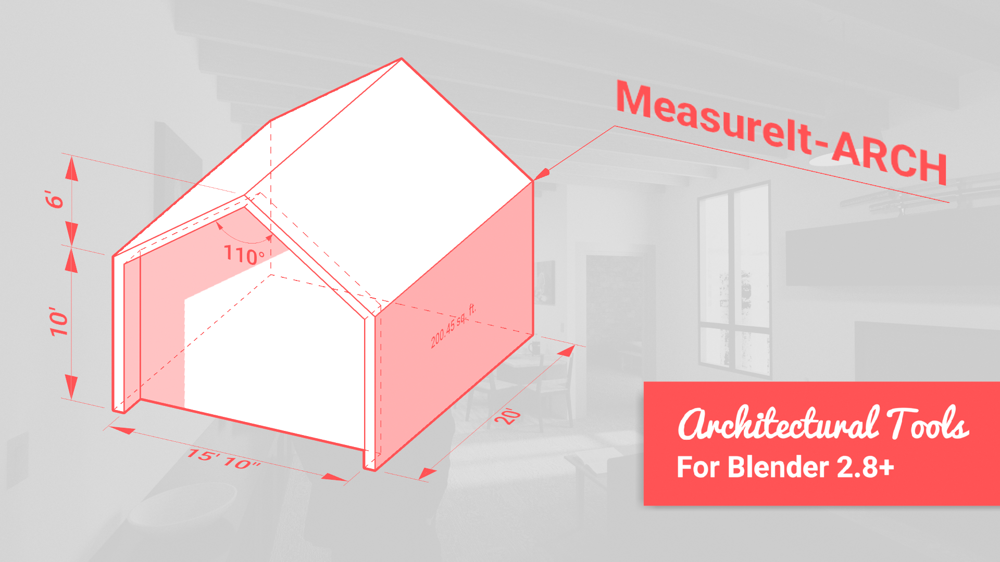

# MeasureIt_ARCH Docs

Welcome to the documentation for MeasureIt_ARCH.

!!! Warning
    This documentation is currently a work in progress, you may find broken links, incomplete thoughts, missing content, and many many spelling errors at the moment.

    If you'd like to contribute to these Docs, each page has a link in the top right to the source code on GitHub where you can edit, and submit Pull Requests for corrections.

    Thanks!
    -Kevan

## What is MeasureIt_ARCH?

MeasureIt_ARCH is an addon for Blender, that adds tools to create design documentation and technical drawings that can be previewed within Blender's 3D viewport, and exported as images, vector graphics or .dxf files.

## What's in the Docs?

This Documentation Covers:

- **Introduction:** An overview of MeasureIt_ARCH, it's Features and User Interface, and an FAQ
- **Tutorials:** a few sample workflows for creating and documenting models with Blender and MeasureIt_ARCH.
- **Property Descriptions:** Detailed descriptions of each of MeasureIt_ARCH's features and properties.
- **Contributions:** Guidlines for reporting issues and contributing to MeasurIt_ARCH development.

 