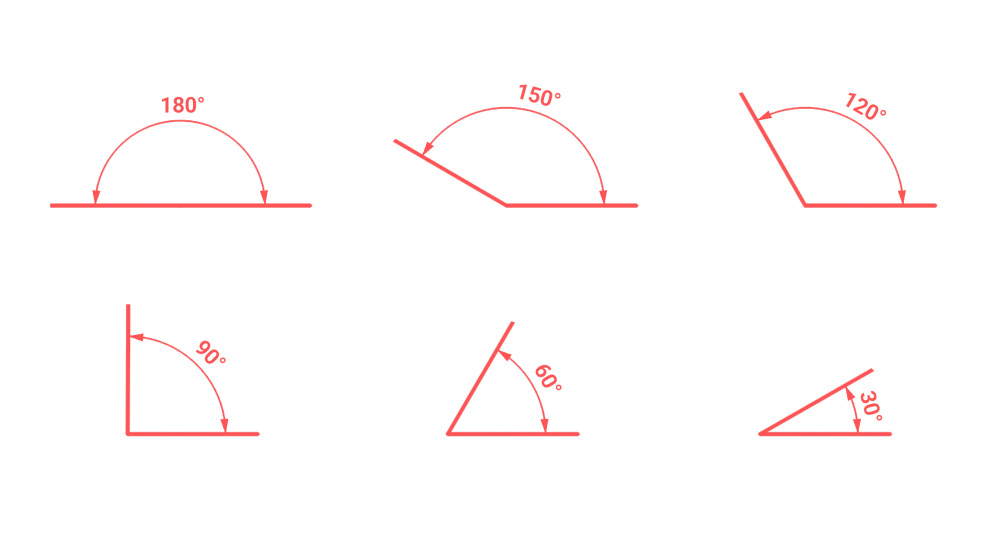
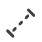
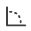
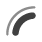

# Dimensions

MeasureIt_ARCH dimensions display a measurement.

## Dimension Types
MeasureIt_ARCH offers the following Dimension Types:

- **Aligned:** A straight line measurement between two points.

- **Axis:** A straight line measurement between two points, along a specified axis.

- **Bounds:** Measurements along the X,Y,Z axes of an object's (or collection of object's) bounding box.
- **Angle:** Measures the angle between two lines.

- **Arc:** Measures the radius and arc length along an arc defined by 3 points.

- **Area:** Measures the Area of defined by a selection of object faces.

___

## Adding Dimensions (MeasureIt_ARCH Main Panel)

Buttons for adding each of the dimension types can be found in the MeasureIt_ARCH main panel, in the 3D viewport. You can also access these operators by search for their name in Blender's the [Operator Search menu (F3)](https://docs.blender.org/manual/en/2.82/interface/controls/templates/operator_search.html).

#####  Aligned
Adds an Aligned Dimension between 2 Objects or Vertices.

   * In Object Mode: Select two objects and then press the Aligned Button.
   * In Edit Mode: Select two or more Vertices and press the Aligned Button.

#####  Axis

 * Adds a Dimension that measures along a single Axis between 2 Objects or Vertices.
   * Object Mode: Select two objects and then press the Aligned Button.
   * Edit Mode: Select two or more Vertices and press the Aligned Button.

 * __Axis Selection__: Picks the axes to be dimensioned on creation.

##### Bounds (Object Mode Only)

 * Adds a set of Dimensions that measure the Bounding Box of the selected object
 * __Axis Selection__: Picks the bounding box axis to be displayed on creation.

##### Angle (Edit Mode Only)

 * Adds an Angle Dimension for 3 selected vertices.
   * The 2nd vertex selected defines the corner of the angle.

#####  Arc (Edit Mode Only)

 * Adds an Arc Dimension circumscribing the 3 selected vertices.

##### Area (Edit Mode Only)

 * Adds an Area Dimension to the selected faces.
   * The Area Dimension text will be placed at the center of the bounding box of the active face.

#####  Dimension Style (Color Swatch Icon)

 * Selects a Style to be assigned to new dimensions on creation.

##### View Plane (Axis Icon)

 * Lets you select the preferred view plain for new dimensions (used to automatically place dimensions on creation).
   * __XY Plane (Plan View)__: Dimensions placed to be viewed from the top or bottom.
   * __YZ Plane (Section/ Elevation View)__: Dimensions placed to be viewed from the left or right.
   * __XZ Plane (Section/ Elevation View)__: Dimensions placed to be viewed from the front or back.
   * __None__: Dimensions placement will adjust automatically based on your viewpoint and the angles of the adjacent surfaces.

---

## Dimension List (Object Settings)

The Dimension List lets you select and edit the properties of the dimensions attached to the actively selected object.

 * __Color__: Sets Dimension Color.
 * __Link Style (Link or Broken Link Icon)__: Toggles if this Dimension uses a Style.
 * __Visibility (Eye Icon)__: Toggles the Dimension's visibility.
 * __Delete (x Icon)__: Deletes the Dimension.

### Dimension Sub Menu (Chevron Icon)

 * __Add to Area (Edit Mode Only)__: Adds selected Faces to the active Area Dimension.
 * __Remove from Area (Edit Mode Only)__: Removes selected Faces from the active Area Dimension.
 * __Cursor to Arc Origin__: Snaps the 3D cursor to the center of the active Arc Dimension.

---

## Dimension Settings (Object Settings)

 * __Font__: Lets you select a custom font for the Dimension.
 * __View Plane__: The preferred view plane for the Dimension.
   * __XY Plane (Plan View)__: Dimension will be placed to be viewed from the top or bottom.
   * __YZ Plane (Section/ Elevation View)__: Dimension will be placed to be viewed from the left or right.
   * __XZ Plane (Section/ Elevation View)__: Dimension will be placed to be viewed from the front or back.
   * __None__: Dimension's placement will be based on the angles of the adjacent surfaces.
 * __Measurement Axis (Axis & Bounds Dimensions Only)__: Select the Axis to Measure.
 * __Visible In View__: Limit the Dimension's visibility to a specific Camera in your scene.
   * If no Camera is selected the Dimension will be visible in all Cameras.
   * If a Camera is selected the Dimension will only be visible when that Camera is the Active Camera.
 * __Line Weight__: The Dimension's Line Weight.
 * __Distance__: The Distance of the Dimension Text from the Objects or Vertices it's attached to.
 * __Radius (Arc and Angle Dimensions Only)__: The Distance of the Dimension Text from the center of the Arc or Angle.
 * __Offset__: The offset distance from the ends of the Dimension line to the Vertex or Object it's attached to.
 * __Rotation__: Rotates the Dimension around the axis of its measurement.
 * __Font Size__: The Dimension font size.
 * __Resolution__: The Dimension font resolution.
 * __Alignment__: The Dimension text alignment relative to the dimension line (Left, Center, Right).
 * __Arrow Start & End__: Set the style of the dimension terminations. 
 * __Arrow Size__: The size of the Dimension's terminations.
 * __Arrow Angle__: The angle of Dimension's triangle and arrow terminations.
 * __Draw In Front__: Makes this element Ignore Visibility tests.
 * __Evaluate Depsgraph__: Evaluate Blender's Dependency Graph before drawing this MeasureIt_ARCH element.