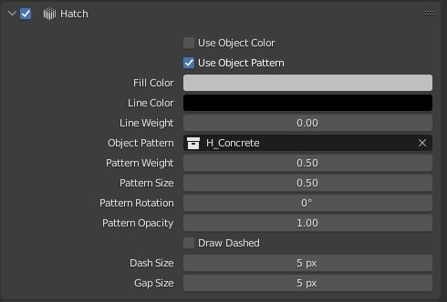

# Hatches
MeasureIt_ARCH Hatches create areas of solid or patterned fill in Vector Renders. Hatches are defined per material and can be found under the material settings panel.

### Hatch Settings

* __Use Object Color__: If enabled this hatch will use the object color, rather than the hatches fill color
* __Use Object Pattern__: If enabled this hatch will use a per object pattern setting, rather than a single pattern for instance of this hatch.

    !!! Note
        This can be especially usefull for sections if you want to use a general "Cut" Material that gets applied by a boolean modifier, with a variety of different hatch patterns to denote differnt surface properties.

        For more detail on this workflow see the ["Cutting Sections with MeasureIt_ARCH" Tutorial](../tutorials/sections.md)

* __Fill Color__: Solid Fill color for this Hatch (Set Alpha to 0 for none)
* __Line Color__: Outline Line Color for this Hatch (Set Alpha to 0 for none)
* __Line Weight__: Line Wight for the Outline Line of this Hatch
*  __Pattern__: A collection to use as a custom pattern fill for this hatch.

    !!! Note
        * Hatch Patterns need to be drawn at the origin in the 0 to 1 range on the x,y plane.
        * Hatch Patterns will draw all edges of the objects in the hatch collection as the custom pattern
        * Be sure to "Apply All Transforms" (ctrl-A) to objects in the Hatch pattern collection

*  __Pattern Weight__: Line Weight for the pattern fill
*  __Pattern Size__: Scale factor for the pattern fill
*  __Pattern Rotation__: Rotates the pattern fill for this hatch.
*  __Pattern Opacity__: Sets the opacity for the pattern fill for this hatch.
*  __Draw Dashed__: The outline of this hatch will draw dashed
*  __Dash Size__: Dash size for dashed outlines
*  __Gap Size__: Gap size for dashed outlines
