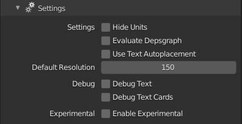

#  Settings

##### Hide Units

 * Show or hide the unit text on Metric Dimension elements.

##### Evaluate Depsgraph

* Evaluate Blender's Dependency Graph before drawing MeasureIt_ARCH elements.

!!! WARNING
    By default, MeasureIt_ARCH only evaluates the Dependency Graph for an object when exiting edit mode to improve drawing performance. Enabling this setting will make MeasureIt_ARCH attempt to evaluate the dependency graph every time the scene draws, this can be very slow.

    Depsgraph Evaluation can be enabled per element as well, please only enable it for the whole scene if absolutely necessary

##### Use Text Autoplacement
 * Automatically move dimension text to the outside of the dimension line if it is too large to fit within.

##### Default Resolution
  * Resolution to use for text rendering if no view resolution has been defined

##### Scene Depth Test Method:
  * Changes the depth test algorithm used for the scene (also found in the scene setting panel). 
    * __Depth Buffer:__ Samples many points along each line and compares them to the raster depth buffer to determine visibility. Generally faster but its speed and accuracy are both dependent on the views Resolution.
    * __Geometric:__ _(in development)_ Generates a view map containing all mesh geometry in the scene to geometrically compute transitions in visibility. Generally much slower on large scenes, but determines precise start and end points for all line segments. Recommended where absolute precision is necessary in linework, such as when rendering to .dxf for other applications.

    !!! Note
        Geometric Depth testing currently only computes edge intersections when partitioning line segments. This works well enough for plan and elevation views and orthogonal geometry but may not give expected results where lines pass through faces that are not orthogonal to the camera. Adding support for Line-Face intersections to the view map is planned but not yet implemented.

##### Debug Text
 * Writes Dimension Text to an image for Debug

##### Debug Text Cards
  * Draw Dimension Text Cards for Debug

##### Enable Experimental
  * Enable Experimental Features in MeasureIt_ARCH

##### Instance Dimensions
 * Will Enable Dimension Instancing.

!!! WARNING
    Text on instanced Dimensions will not account for changes in the instances scale or rotation.

