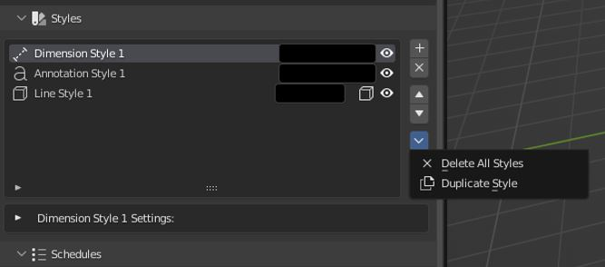

# Styles

Styles have a nearly identical user interface to their corresponding items. Style-able properties can be found in the item's settings.

Note that some settings, like an Annotations Offset, or a Dimensions Distance, are still set per item, even when using a style.

## Styles Extra's Menu

 - **Delete All Styles:** Deletes all styles in the scene.
 - **Duplicate Style:** Duplicates the active Style