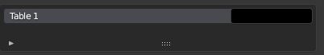
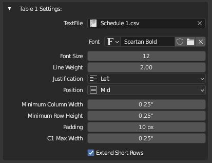

# Tables

Often when documenting a project it's helpful to be able to embed a table of information into a drawing (To display door and window schedules, zoning information etc.). MeasureIt_ARCH Tables provide a simple way to display Comma Separated Value (CSV) tables in a drawing. Tables automatically scale cells to fit the provided content.

Tables can be used with the CSV's produced by MeasureIt_ARCH [Schedules.](schedules.md)

!!! Warning
    Tables are currently under development, their behavior may change.

## Adding Tables (MeasureIt_ARCH Main Panel)

#####  Table:
 * Adds a table to an Empty Object at the location of the 3D cursor.

---

## Table List (Object Settings)

The Tables List lets you select and edit the properties of the Tables attached to the actively selected object.

 * __Name__: Sets the Table's name.
 * __Color__: Sets Table's Color.

---

## Table Settings

 * __Text File__: The text file (CSV) used to populate the table. CSV files can be written or loaded in from Blender's Text Editor
 * __Font__: Lets you select a custom font for the Annotation from your system.
 * __Font Size__: The Table's font size.
 * __Line Weight__: Line Weight of the Table lines.
 * __Justification__: Text Justification within the Table Cells (Left, Center, Right).
 * __Position__: Text Position relative to the end of the Annotation leader line (Top, Middle, Bottom).

!!! Note
    Text Justification and Position can be adjusted per cell by including markups in the CSV text. See Below.

 * __Minimum Column Width__: The minimum width (in drawing space) for all columns in the table. Applies to empty cells as well.
 * __Minimum Row Height__: The minimum height (in drawing space) for all rows in the table. Applies to empty cells as well.
 * __Padding__: Clear space (in pixels) between the text and cell border.
 * __C1 Max Width__: The maximum width of the first column. Can be useful when the first column is being used for Categories & Headers.
 * __Extend Short Rows__: When enabled, blank rows will not draw cell dividers.

## Table Text Fields:
Displays a list of the Text Fields for the selected Table. [(See TextFields Documentation)](textfields.md)
Table TextFields are automatically populated from the provided CSV file, so the raw text is not directly editable here, however cell text can be overwritten using the TextField's AutoFill settings. 

This can be used to inject AutoFill information into a Table, or to link multiline text from a separate text file into a single cell (handy for Wall Schedules) via the 'Text File' Autofill option.

---

## Cell Markup Formatting

To Provide further formatting options for individual cells, MeasureIt_ARCH table use markup codes within the CSV to provide formatting information. The markup code can be included anywhere within the cell text, and multiple codes can be included in each cell. The following codes are supported.

* `[l]` Justify Text Left.
* `[c]` Justify Text Center.
* `[r]` Justify Text Right.
* `[t]` Position Text at the Top of the cell.
* `[m]` Position Text at the Middle of the cell.
* `[b]` Position Text at the Bottom of the cell.
* `[br]` or `[\n]` Include a line break at this point in the cell's text.
