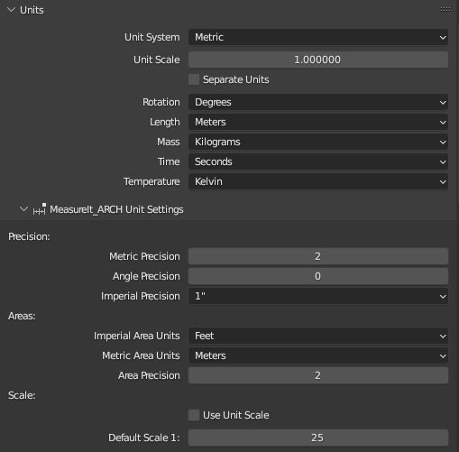

# MeasureIt_ARCH Unit Settings

MeasureIt_ARCH Unit Settings can be found in Blender's Scene Settings under the Units panel.

##### Metric Precision
 * Defines the number of decimal places included in dimensions when using the Metric Unit System.

##### Angle Precision
  * Defines the number of decimal places included in angle dimensions.

##### Imperial Precision
 * Fractional Precision to be used when using the Imperial Unit System.

 ##### Default Scale
  * Scale used for text and other scale-dependant elements if no view has been defined.