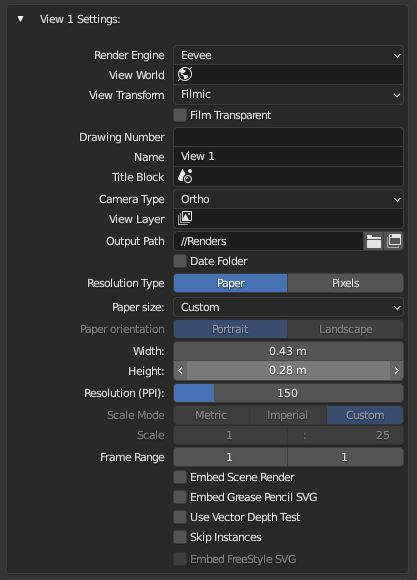

#  Views
MeasureIt_ARCH Views allow you to store, and quickly switch between different scene set-ups with unique Camera, Viewlayer, World, and Scale settings. Views can be thought of as serving a similar purpose as Paper Space Layouts in other CAD software.

## Views List (Scene Settings)

The Views List lets you switch between Views and edit the properties of the actively selected view.

* __Drawing Number:__ Defines a Drawing Number for this View (To be used in titleblock for example)
* __Name:__ Defines a name for this View (To be used in titleblock for example)
* __Camera__: Sets View Camera
* __Include in Batch Render (Camera Icon):__ If enabled this view will be included in batch renders

### View Side Buttons

* __Add (+ Icon)__: Adds a new View.
* __Delete (x Icon)__: Deletes the active View.

* __Move Up (Up Arrow Icon)__: Moves the active View up the list.
* __Move Down (Down Arrow Icon)__: Moves the active View down the list.

### View Sub Menu (Chevron Icon)

 * __Duplicate Selected View__: Creates a copy of the active view with the same settings
 * __Duplicate View With Layer__: Duplicates the Active view with an option to define a new View Layer, and Create a new Camera for the new view
 * __Batch Render Views__: Starts a Vector Render for all Views with "Include in Batch Render" Enabled.

---

## View Settings (Scene Settings)

* __Render Engine:__ Sets the render engine for this view
* __View World:__ Sets the World for this view
* __View Transform:__ Sets the color transform for renders from this view
* __Film Transparent:__ Enables or disables a transparent background for renders from this view
* __Drawing Number:__ Defines a Drawing Number for this View (To be used in titleblock for example)
* __Name:__ Defines a name for this View (To be used in titleblock for example)
* __Title Block:__ Sets a scene to be used as the titleblock for this View
* __Camera Type__: Sets the type of camera for this view (Orthographic or Perspective)
* __View Layer__: Sets the View Layer to be used for this view
*  __Output Path__: Sets Render Output Path for this view
*  __Date Folder__: When enabled, a folder with todays date will be added to the Output Path
*  __Resolution Type__: Pick Paper or Pixel based resolution settings for this view
    
    !!! Note
        Pixel resolution type is the same as Blenders default render resolution settings

*  __Paper Size:__ Picks a preset paper size to use for this View
*  __Width__: Paper Width defined in scene units (if custom paper size is selected)
*  __Height__: Paper Height defined in scene units (if custom paper size is selected)

*  __Resolution__: Resolution for this view 

    !!! Warning
        This also effects the resolution of the depth buffer used for vector depth testing, if you find you having issues with lines over or under extending in vector renders, try increasing the resolution.

*  __Scale Mode:__ Selects whether scale is selected from a dropdown of common Metric or Imperial Scales, or defined using the scale ratio setting below
*  __Scale__:  Defines the Orthographic Scale as a ratio between Model Units, and Paper Units.
*  __Frame Range__: The frame range to render for this view.

* __Embed Scene Render:__ When enabled, a regular Blender render of the view will be saved and embeded in Vector Renders
* __Embed Grease Pencil SVG:__ When enabled, an svg export of grease pencil object (including lineart) will be saved and embeded in Vector Renders
* __Use Vector Depth Test:__ When enabled, line groups will be depth tested against a raster depth buffer of the scene to remove (or draw dashed) hidden lines.

    !!! Warning
        The accuracy of depth testing is heavily resolution dependant.

* __Embed Freestyle SVG:__ When enabled, a freestyle rendering will be done, saved and embeded in Vector Renders. (Requires the Freestyle SVG addon be enabled)
